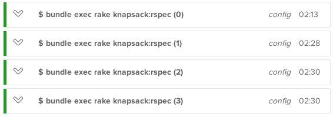

# 

[][gem_version]
[][travis]
[][codeclimate]
[][coverage]

[gem_version]: https://rubygems.org/gems/knapsack
[travis]: http://travis-ci.org/ArturT/knapsack
[codeclimate]: https://codeclimate.com/github/ArturT/knapsack
[coverage]: https://codeclimate.com/github/ArturT/knapsack

Parallel specs across CI server nodes based on each spec file's time execution. It generates a spec time execution report and uses it for future test runs.

Short [presentation](http://slides.com/arturt/knapsack) about gem.

### Without Knapsack

### With Knapsack

## Installation

Add this line to your application's Gemfile:

    gem 'knapsack'

And then execute:

    $ bundle

## Usage

Add at the beginning of your `spec_helper.rb`:

    require 'knapsack'

    # default configuration, you can change it or omit completely
    Knapsack.tracker.config({
      enable_time_offset_warning: true,
      time_offset_in_seconds: 30
    })

    # default configuration for report, you can change it or omit completely
    Knapsack.report.config({
      report_path: 'knapsack_report.json'
    })

    # you can use your own logger or omit completely
    require 'logger'
    Knapsack.logger = Logger.new(STDOUT)
    Knapsack.logger.level = Logger::INFO

    # bind adapter, required
    Knapsack::Adapters::RspecAdapter.bind

Add in your `Rakefile` this lines:

    require 'knapsack'
    Knapsack.load_tasks

Generate time execution report for your spec files. Run below command on one of your CI nodes.

    $ KNAPSACK_GENERATE_REPORT=true bundle exec rspec spec

Commit generated report `knapsack_report.json` into your repository.

This report should be updated only after you add a lot of new slow tests or you change existing ones which causes a big time execution difference between CI nodes. Either way, you will get time offset warning at the end of the rspec results which reminds you when it’s a good time to regenerate the knapsack report.

## Setup your CI server

On your CI server run this command for the first CI node. Update `CI_NODE_INDEX` for the next one.

    $ CI_NODE_TOTAL=2 CI_NODE_INDEX=0 bundle exec rake knapsack:rspec

You can add `KNAPSACK_SPEC_PATTERN` if your specs are not in `spec` directory. For instance:

    $ KNAPSACK_SPEC_PATTERN="directory_with_specs/**/*_spec.rb" CI_NODE_TOTAL=2 CI_NODE_INDEX=0 bundle exec rake knapsack:rspec

You can set `KNAPSACK_REPORT_PATH` if your knapsack report was saved in non default location. Example:

    $ KNAPSACK_REPORT_PATH="custom_knapsack_report.json" CI_NODE_TOTAL=2 CI_NODE_INDEX=0 bundle exec rake knapsack:rspec

### Info about ENV variables

`CI_NODE_TOTAL` - total number CI nodes you have.

`CI_NODE_INDEX` - index of current CI node starts from 0. Second CI node should have `CI_NODE_INDEX=1`.

### Info for CircleCI users

If you are using circleci.com you can omit `CI_NODE_TOTAL` and `CI_NODE_INDEX`. Knapsack will use `CIRCLE_NODE_TOTAL` and `CIRCLE_NODE_INDEX` provided by CircleCI.

Here is example for test configuration in your `circleci.yml` file.

For the first time run all specs on a single CI node with enabled report generator.

    test:
      override:
        - KNAPSACK_GENERATE_REPORT=true bundle exec rspec spec

After tests pass on your CircleCI machine your should copy knapsack json report which is rendered at the end of rspec results. Save it into your repository as `knapsack_report.json` file and commit.

Now you should update test command and enable parallel. Please remember to add additional containers for your project in CircleCI settings.

    test:
      override:
        - bundle exec rake knapsack:rspec:
            parallel: true

Now everything should works. You will get warning at the end of rspec results if time execution will take too much.

### Info for Travis users

You can parallel your builds across virtual machines with [travis matrix feature](http://docs.travis-ci.com/user/speeding-up-the-build/#Parallelizing-your-builds-across-virtual-machines). Edit `.travis.yml`

    script: "bundle exec rake knapsack:rspec"
    env:
      - CI_NODE_TOTAL=2 CI_NODE_INDEX=0
      - CI_NODE_TOTAL=2 CI_NODE_INDEX=1

If you want to have some global ENVs and matrix of ENVs then do it like this:

    script: "bundle exec rake knapsack:rspec"
    env:
      global:
        - RAILS_ENV=test
        - MY_GLOBAL_VAR=123
      matrix:
        - CI_NODE_TOTAL=2 CI_NODE_INDEX=0
        - CI_NODE_TOTAL=2 CI_NODE_INDEX=1

Such configuration will generate matrix with 2 following ENV rows:

    CI_NODE_TOTAL=2 CI_NODE_INDEX=0 RAILS_ENV=test MY_GLOBAL_VAR=123
    CI_NODE_TOTAL=2 CI_NODE_INDEX=1 RAILS_ENV=test MY_GLOBAL_VAR=123

More info about global and matrix ENV configuration in [travis docs](http://docs.travis-ci.com/user/build-configuration/#Environment-variables).

## Tests

### Spec

To run specs for Knapsack gem type:

    $ bundle exec rspec spec

### Spec examples

Directory `spec_examples` contains examples of fast and slow specs. There is a `spec_example/spec_helper.rb` with binded Knapsack.

To generate a new knapsack report for specs with `focus` tag (only specs in `spec_examples/leftover` directory have no `focus` tag), please type:

    $ KNAPSACK_GENERATE_REPORT=true bundle exec rspec --default-path spec_examples --tag focus

**Warning:** Current `knapsack_report.json` file was generated for `spec_examples` except `spec_examples/leftover` directory. Just for testing reason to see how leftover specs will be distribute in a dumb way across CI nodes.

To see specs distributed for the first CI node type:

    $ CI_NODE_TOTAL=2 CI_NODE_INDEX=0 KNAPSACK_SPEC_PATTERN="spec_examples/**/*_spec.rb" bundle exec rake knapsack:rspec

Specs in `spec_examples/leftover` take more than 3 seconds. This should cause a Knapsack time offset warning because we set `time_offset_in_seconds` to 3 in `spec_examples/spec_helper.rb`. Type below to see warning:

    $ bundle exec rspec --default-path spec_examples

## Contributing

1. Fork it ( https://github.com/ArturT/knapsack/fork )
2. Create your feature branch (`git checkout -b my-new-feature`)
3. Commit your changes (`git commit -am 'Add some feature'`)
4. Push to the branch (`git push origin my-new-feature`)
5. Create a new Pull Request

## Acknowledgements

Many thanks to [Małgorzata Nowak](https://github.com/informatykgosia) for beautiful logo.
